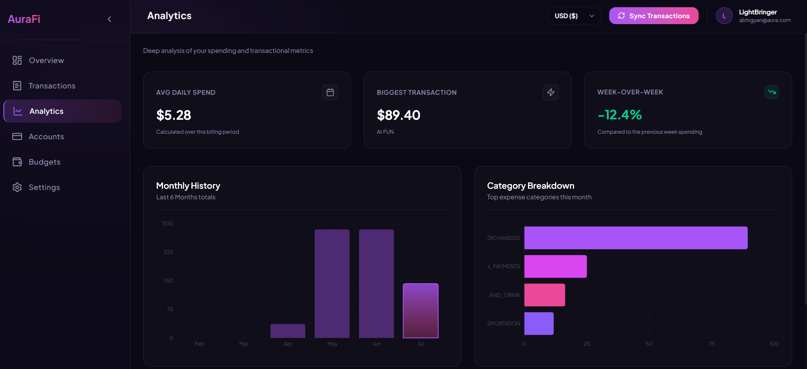
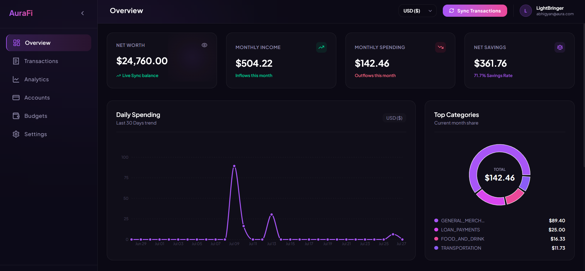
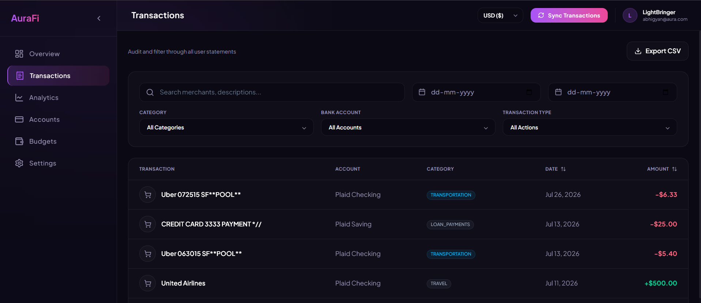
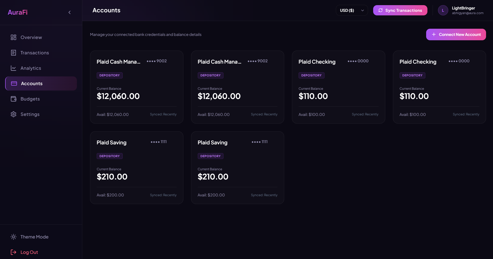
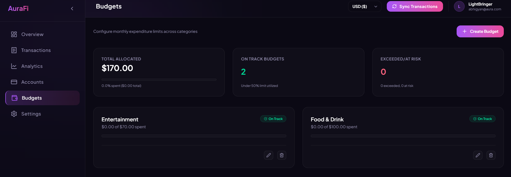

# AuraFi

AuraFi is a modern, comprehensive personal finance application designed to provide users with complete visibility and control over their financial health. By securely aggregating banking data, AuraFi empowers users to track net worth, monitor transactions, and manage budgets in real time.

## Features

- **Financial Dashboard**: A centralized overview of your total net worth, recent spending, and active accounts.
- **Bank Synchronization**: Secure integration with external financial institutions to pull real-time account balances and transaction history.
- **Budget Management**: Set and monitor monthly spending limits across various categories with visual progress tracking.
- **Transaction Analytics**: Categorized transaction histories and intelligent spending breakdowns.
- **Multi-Currency Support**: Native ability to view your finances in your preferred local currency with automatic conversion capabilities.

## Showcase

<table style="width: 100%;">
  <tr>
    <td align="center">
      <strong>Analytics Dashboard</strong> 
      
    </td>
    <td align="center">
      <strong>Financial Overview</strong> 
      
    </td>
  </tr>
  <tr>
    <td align="center">
      <strong>Transactions & Sync</strong> 
      
    </td>
    <td align="center">
      <strong>Connected Accounts</strong> 
      
    </td>
  </tr>
  <tr>
    <td align="center">
      <strong>Budget Management</strong> 
      
    </td>
    <td></td>
  </tr>
</table>

## Tech Stack

AuraFi is built using a modern, scalable, and type-safe architecture:

- **Frontend framework**: Next.js (App Router) with React
- **Styling**: Tailwind CSS
- **Authentication**: NextAuth.js
- **Database**: PostgreSQL
- **ORM**: Prisma
- **Financial Data API**: Plaid

## Plaid Sandbox Integration

AuraFi utilizes the Plaid API to securely sync financial data. For development and testing purposes, the application is configured to run entirely within the Plaid Sandbox environment. 

The Plaid Sandbox provides simulated bank accounts and transactions, allowing developers to test the full lifecycle of linking accounts, fetching balances, and syncing transactions without connecting to actual financial institutions or using real credentials.

To use the sandbox environment locally:
1. Obtain Sandbox credentials from the Plaid developer dashboard.
2. Provide them in your environment variables.
3. Use the Plaid Sandbox test credentials (e.g., username `user_good`, password `pass_good`) when prompted by the Plaid Link interface.

## Local Development

To run AuraFi locally, ensure you have Node.js and PostgreSQL installed.

1. Clone the repository.
2. Install dependencies using `npm install`.
3. Configure your `.env` file with your database connection string and Plaid Sandbox credentials.
4. Run the database migrations using `npx prisma db push`.
5. Start the development server with `npm run dev`.

The application will be available at `http://localhost:3000`.

## License

This project is licensed under the MIT License.
